# DICE — Production System Design Document

> **DICE (Digital Identity & Compliance Ecosystem)** — an enterprise AI‑powered compliance & certification management platform by **Sanyog Conformity Solutions**.
>
> **Document status:** v1.0 · Release Candidate (v2.0.0) · Audience: Investors, Enterprise clients, ISO/SOC 2 auditors, Engineering onboarding.
> **Grounding:** Every statement below is derived from the actual codebase (`backend/`, `admin-dashboard/`, `mobile-app/`, `docs/`). Statements that extrapolate beyond code are explicitly marked **[ASSUMPTION]**.

---

## 1. Executive Summary

DICE is a three‑surface compliance platform that helps exporters, manufacturers, importers and consultants obtain and manage regulatory certifications (BIS, FSSAI, CE, ISO, etc.) across markets. It comprises:

- **Mobile app** (React Native + Expo SDK 54, RN 0.81, New Architecture + Hermes) — the customer surface.
- **Admin dashboard** (React 18 + Vite 5) — the staff/CRM surface for manual review, workflow operations, Customer 360 and analytics.
- **Backend API** (Node 20 + Express + TypeScript, MongoDB, Redis) — a single authoritative service exposing `/api/v1` and `/api/v2` (identical routers) with a workflow engine, deny‑by‑default RBAC, payments, documents, AI, notifications, and an immutable time‑series audit log.

The platform is at **Release Candidate**: backend builds clean and passes 239/240 tests, the admin builds clean, and the mobile app builds and runs on Android and iOS. The core certification lifecycle — including the **product‑not‑found → manual review → manager resolution → workflow → certificate** path — has been verified end‑to‑end (28/28 live API assertions).

**Overall production‑readiness: GO on code** (no P0/P1 code blockers outstanding); remaining work is operational (EAS store builds, production credentials, store‑console setup, monitoring).

---

## 2. High‑Level Architecture

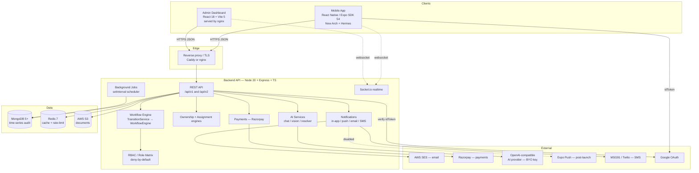
```mermaid
flowchart TB
    subgraph Clients
      M[Mobile App<br/>React Native / Expo SDK 54<br/>New Arch + Hermes]
      A[Admin Dashboard<br/>React 18 + Vite 5<br/>served by nginx]
    end

    subgraph Edge
      CDN[Reverse proxy / TLS<br/>Caddy or nginx]
    end

    subgraph Core[Backend API — Node 20 + Express + TS]
      API[REST API<br/>/api/v1 and /api/v2]
      WF[Workflow Engine<br/>TransitionService → WorkflowEngine]
      RBAC[RBAC / Role Matrix<br/>deny-by-default]
      OWN[Ownership + Assignment engines]
      AIsvc[AI Services<br/>chat / vision / resolver]
      PAY[Payments — Razorpay]
      NOTI[Notifications<br/>in-app / push / email / SMS]
      JOBS[Background Jobs<br/>setInterval scheduler]
      WS[Socket.io realtime]
    end

    subgraph Data
      MDB[(MongoDB 5+<br/>time-series audit)]
      RDS[(Redis 7<br/>cache + rate-limit)]
      S3[(AWS S3<br/>documents)]
    end

    subgraph External
      SES[AWS SES — email]
      RZP[Razorpay — payments]
      OAI[OpenAI-compatible<br/>AI provider — BYO key]
      EXPO[Expo Push — post-launch]
      SMS[MSG91 / Twilio — SMS]
      GOOG[Google OAuth]
    end

    M -->|HTTPS JSON| CDN
    A -->|HTTPS JSON| CDN
    CDN --> API
    M -. websocket .-> WS
    A -. websocket .-> WS
    API --> WF --> RBAC
    API --> OWN
    API --> AIsvc --> OAI
    API --> PAY --> RZP
    API --> NOTI --> SES
    NOTI --> SMS
    NOTI -. disabled .-> EXPO
    API --> MDB
    API --> RDS
    API --> S3
    JOBS --> MDB
    M -->|idToken| GOOG
    API -->|verify idToken| GOOG
```

**Key design principle:** a **single authoritative backend** with one workflow‑transition path. All state changes funnel through `TransitionService → WorkflowEngine → audit → notify → issuance` (`backend/src/services/workflow/transitionService.ts`), guaranteeing consistent audit, RBAC and side effects.

---

## 3. Component Diagram

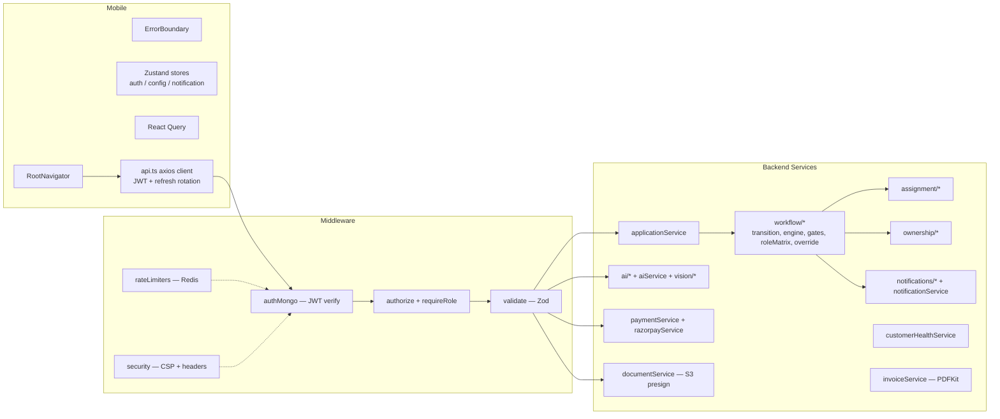
```mermaid
flowchart LR
    subgraph Mobile
      RN[RootNavigator]
      EB[ErrorBoundary]
      Zst[Zustand stores<br/>auth / config / notification]
      RQ[React Query]
      APIc[api.ts axios client<br/>JWT + refresh rotation]
    end

    subgraph Backend Services
      appSvc[applicationService]
      wfSvc[workflow/*<br/>transition, engine, gates, roleMatrix, override]
      asgSvc[assignment/*]
      ownSvc[ownership/*]
      aiSvc[ai/* + aiService + vision/*]
      paySvc[paymentService + razorpayService]
      docSvc[documentService — S3 presign]
      notiSvc[notifications/* + notificationService]
      healthSvc[customerHealthService]
      invSvc[invoiceService — PDFKit]
    end

    subgraph Middleware
      authMw[authMongo — JWT verify]
      authz[authorize + requireRole]
      valid[validate — Zod]
      rl[rateLimiters — Redis]
      sec[security — CSP + headers]
    end

    RN --> APIc --> authMw --> authz --> valid
    valid --> appSvc --> wfSvc
    wfSvc --> asgSvc
    wfSvc --> ownSvc
    valid --> aiSvc
    valid --> paySvc
    valid --> docSvc
    wfSvc --> notiSvc
    rl -.-> authMw
    sec -.-> authMw
```

**Notable backend service modules (evidence):** `services/{workflow,assignment,ownership,ai,notifications,vision}/`, plus `applicationService.ts`, `paymentService.ts`, `razorpayService.ts`, `documentService.ts`, `customerHealthService.ts`, `invoiceService.ts`, `renewalService.ts`, `marketAccessService.ts`, `featureFlags.ts`.

---

## 4. Infrastructure Diagram

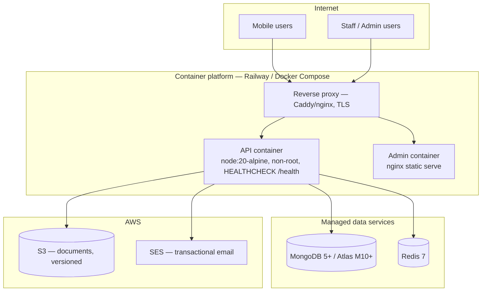
```mermaid
flowchart TB
    subgraph Internet
      U1[Mobile users]
      U2[Staff / Admin users]
    end

    subgraph Host[Container platform — Railway / Docker Compose]
      direction TB
      RP[Reverse proxy — Caddy/nginx, TLS]
      APIc[API container<br/>node:20-alpine, non-root, HEALTHCHECK /health]
      ADMc[Admin container<br/>nginx static serve]
    end

    subgraph Managed[Managed data services]
      MONGO[(MongoDB 5+ / Atlas M10+)]
      REDIS[(Redis 7)]
    end

    subgraph AWS
      S3[(S3 — documents, versioned)]
      SES[SES — transactional email]
    end

    U1 --> RP
    U2 --> RP
    RP --> APIc
    RP --> ADMc
    APIc --> MONGO
    APIc --> REDIS
    APIc --> S3
    APIc --> SES
```

**Evidence:** `backend/Dockerfile` (multi‑stage, `node:20-alpine`, `USER node`, `HEALTHCHECK /health`, `EXPOSE 5000`), `backend/docker-compose.yml` (services: `api`, `mongo:7`, `redis:7-alpine` + named volumes `mongodata/redisdata/uploads`), `backend/railway.json` (Dockerfile builder, `startCommand: npm run db:migrate && node dist/index.js`, healthcheck `/health`, restart on failure ×10). **[ASSUMPTION]** Caddy is the production reverse proxy (stated in project status; not present as a repo config file). `admin-dashboard/Dockerfile` + `nginx.conf` serve the built SPA.

> **Discrepancy noted:** `backend/render.yaml` provisions a **Postgres** `DATABASE_URL` (`fromDatabase`), but the application uses **MongoDB**. Treat `render.yaml` as a **stale/aspirational** alternative; the supported path is **Railway/Docker** with `MONGODB_URI`. **Recommendation:** remove or correct `render.yaml` to avoid onboarding confusion.

---

## 5. Network Architecture

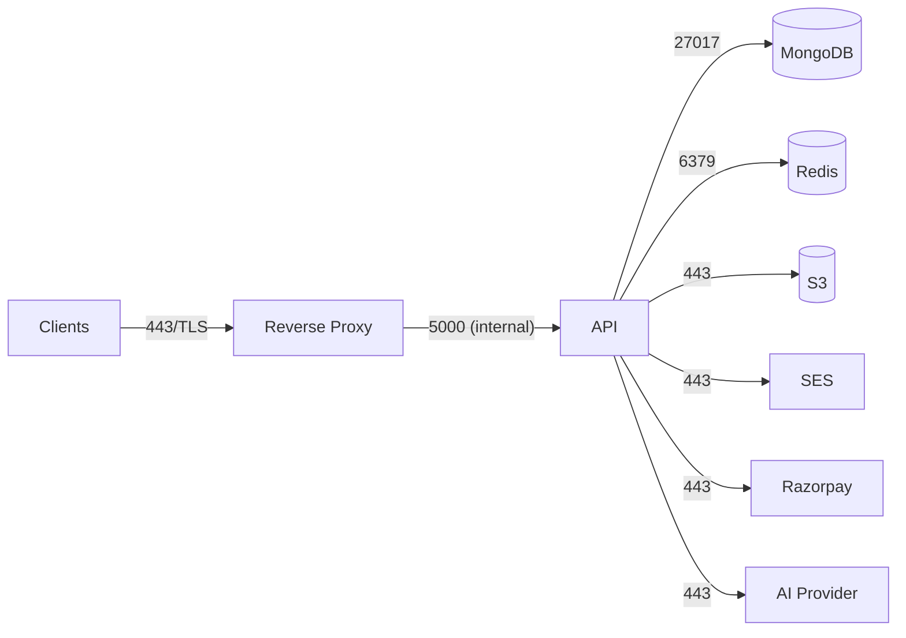
```mermaid
flowchart LR
    C[Clients] -- 443/TLS --> RP[Reverse Proxy]
    RP -- 5000 (internal) --> API[API]
    API -- 27017 --> MONGO[(MongoDB)]
    API -- 6379 --> REDIS[(Redis)]
    API -- 443 --> S3[(S3)]
    API -- 443 --> SES[SES]
    API -- 443 --> RZP[Razorpay]
    API -- 443 --> AIP[AI Provider]
```

- **TLS termination** at the proxy; internal API on port **5000** (`EXPOSE 5000`; local dev `PORT=5001`).
- `app.set('trust proxy', 1)` (`index.ts:64`) so client IPs and rate limits work behind one proxy hop.
- **CORS** is an explicit allowlist (`index.ts:44‑53`): `FRONTEND_URL`, `ADMIN_URL`, `https://admin.sanyogconformity.com`, an S3 website origin, and Expo dev ports; `credentials: true`; **no wildcard**.
- Razorpay **webhook** ingress requires the raw request body — captured via `express.json({ verify })` (`index.ts:59‑61`) for HMAC verification.

---

## 6. AWS Architecture

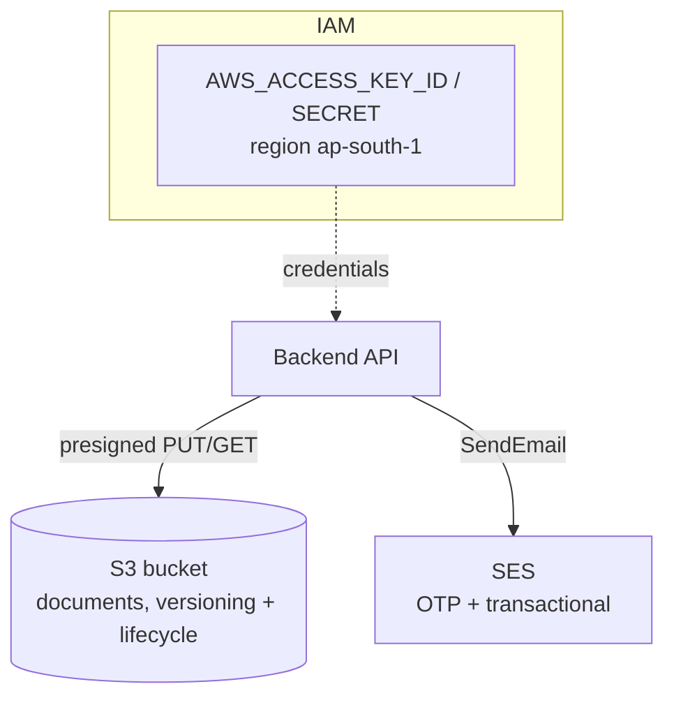
```mermaid
flowchart TB
    API[Backend API] -->|presigned PUT/GET| S3[(S3 bucket<br/>documents, versioning + lifecycle)]
    API -->|SendEmail| SES[SES<br/>OTP + transactional]
    subgraph IAM
      KEY[AWS_ACCESS_KEY_ID / SECRET<br/>region ap-south-1]
    end
    KEY -.credentials.-> API
```

**Evidence of AWS usage (env surface in `backend/src/services/`):** `AWS_ACCESS_KEY_ID`, `AWS_SECRET_ACCESS_KEY`, `AWS_REGION` (observed `ap-south-1`), `AWS_S3_BUCKET`, `AWS_S3_PRESIGNED_URL_EXPIRES`. SDKs: `@aws-sdk/client-s3`, `@aws-sdk/s3-request-presigner`, `@aws-sdk/client-ses`.

- **S3** — document storage via **presigned URLs** (browser/app → S3 directly; server never proxies file bytes). `DEPLOYMENT_GUIDE` recommends **versioning + lifecycle policy**.
- **SES** — OTP and transactional email.
- **[ASSUMPTION]** No CloudFront/EKS/managed queue in code; AWS footprint is intentionally minimal (S3 + SES). Redis/MongoDB are provided by the container platform or Atlas.

---

## 7. Mobile Architecture

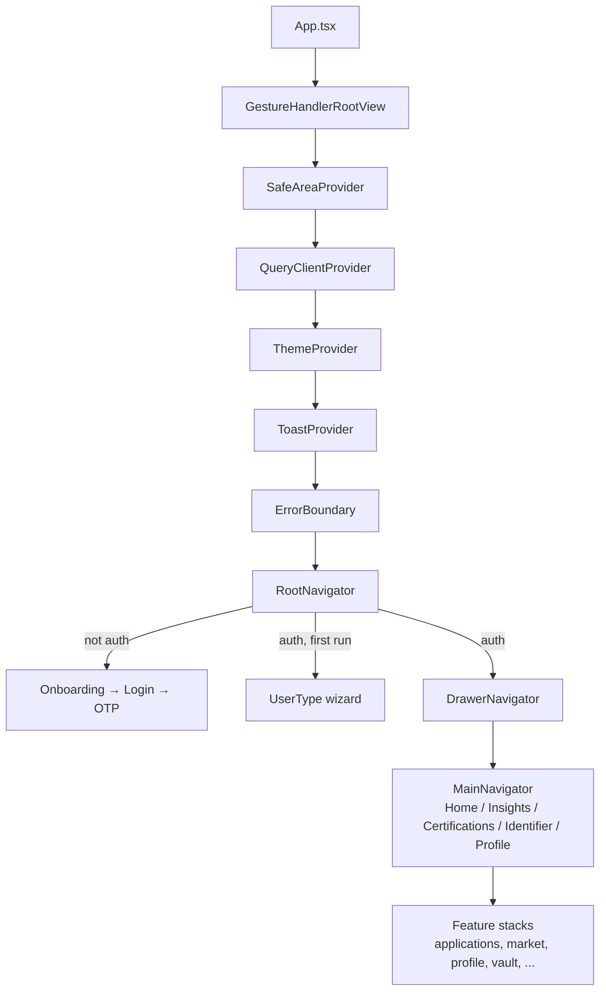
```mermaid
flowchart TB
    App[App.tsx] --> GH[GestureHandlerRootView]
    GH --> SA[SafeAreaProvider]
    SA --> QC[QueryClientProvider]
    QC --> TP[ThemeProvider]
    TP --> TOAST[ToastProvider]
    TOAST --> EBnd[ErrorBoundary]
    EBnd --> Root[RootNavigator]

    Root -->|not auth| Auth[Onboarding → Login → OTP]
    Root -->|auth, first run| UT[UserType wizard]
    Root -->|auth| Drawer[DrawerNavigator]
    Drawer --> Tabs[MainNavigator<br/>Home / Insights / Certifications / Identifier / Profile]
    Tabs --> Stacks[Feature stacks<br/>applications, market, profile, vault, ...]
```

- **Stack:** Expo SDK 54, RN 0.81, **New Architecture + Hermes**, Reanimated 4 + Worklets, React Navigation 7, React Query, Zustand, SVG/Linear‑Gradient/Blur, `@react-native-google-signin`, `react-native-razorpay`, `expo-secure-store`, `expo-local-authentication`.
- **State:** Zustand stores (`authStore`, `configStore`, `notificationStore`) + React Query for server cache (retry 2, staleTime 5m, gcTime 30m).
- **Networking:** `services/api.ts` — axios with JWT request interceptor and **refresh‑token rotation**; on unrecoverable refresh failure it clears all auth state and routes to Login (hardened this cycle).
- **Resilience:** app‑wide **ErrorBoundary** around `RootNavigator` (branded fallback + Retry). **OfflineBanner** for connectivity.
- **Feature flags (Remote Config):** `enable_mca_gstin_lookup` (OFF — external govt APIs pending), `enable_push_notifications` (OFF — push is post‑launch), plus `maintenance_mode`, `enable_ai_assistant`, etc.
- **Config resolution:** `EXPO_PUBLIC_API_URL` → `apiHost/api/v2`; Google client IDs via `.env`/`app.json extra`.

---

## 8. Admin Dashboard Architecture

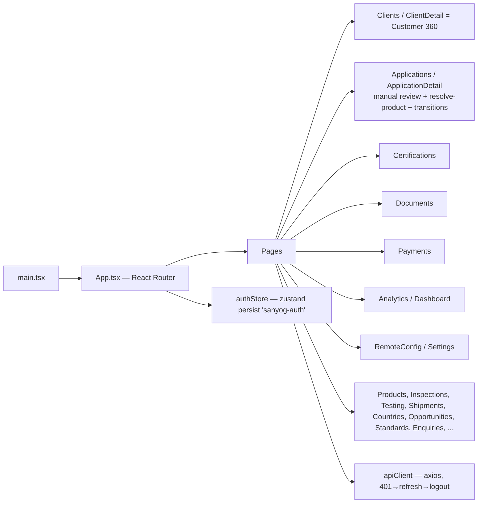
```mermaid
flowchart LR
    Main[main.tsx] --> AppR[App.tsx — React Router]
    AppR --> Pages[Pages]
    Pages --> Cli[Clients / ClientDetail = Customer 360]
    Pages --> Apps[Applications / ApplicationDetail<br/>manual review + resolve-product + transitions]
    Pages --> Certs[Certifications]
    Pages --> Docs[Documents]
    Pages --> Pay[Payments]
    Pages --> An[Analytics / Dashboard]
    Pages --> Rc[RemoteConfig / Settings]
    Pages --> More[Products, Inspections, Testing, Shipments, Countries, Opportunities, Standards, Enquiries, ...]
    AppR --> Auth[authStore — zustand persist 'sanyog-auth']
    Pages --> APIc[apiClient — axios, 401→refresh→logout]
```

- **Stack:** React 18 + Vite 5 + React Router 6 + React Query + Zustand + Recharts + `pdfjs-dist` + `react-markdown`. Served as static SPA by nginx (Dockerfile + `nginx.conf`).
- **Auth:** JWT persisted in `localStorage['sanyog-auth']`; the axios client **forces logout on refresh failure** (correct 401 handling).
- **Verified runtime:** Dashboard, Applications, Clients, Certifications, Documents, Products return **200 OK** with **zero console errors** against the live API. Manual‑review UI is wired: product‑suggestions query + `resolve-product` mutation (HS code + cert type) at `ApplicationDetailPage`.
- **Dev note:** admin dev server runs on **:3001** (`vite.config.ts`), but the backend CORS dev‑default expects **:5173** — set `ADMIN_URL` locally to avoid CORS in dev (prod uses the real domain).

---

## 9. Backend Architecture

**Startup order** (`backend/src/index.ts`): `validateEnv()` → `connectMongo()` → middleware (`cspMiddleware`, `securityHeaders`, `cors`, `compression`, `express.json` + raw‑body capture, `urlencoded`, `morgan`) → **Socket.io** → static `/uploads` → routers mounted at `/api/v1` and `/api/v2` (both behind `generalLimiter`) → `errorHandler` → `listen()` → `startBackgroundJobs()`. Graceful shutdown on `SIGTERM/SIGINT` (disconnect Mongo, 30s force timeout) + `unhandledRejection`/`uncaughtException` guards.

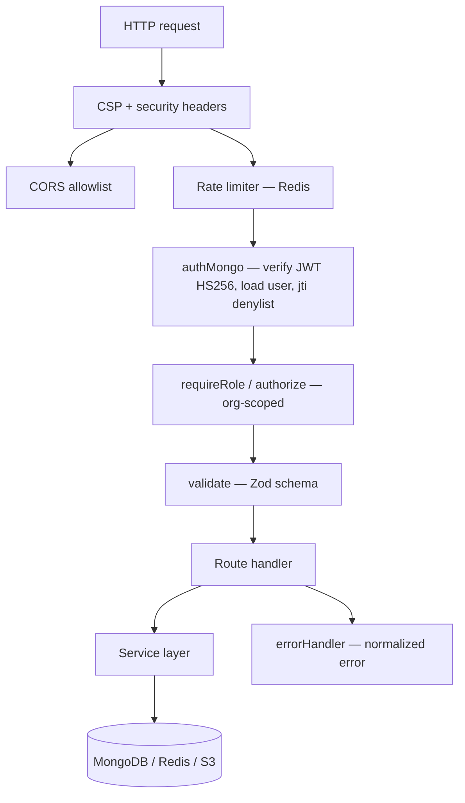
```mermaid
flowchart TB
    REQ[HTTP request] --> SEC[CSP + security headers]
    SEC --> CORS[CORS allowlist]
    SEC --> RL[Rate limiter — Redis]
    RL --> AUTH[authMongo — verify JWT HS256, load user, jti denylist]
    AUTH --> AUTHZ[requireRole / authorize — org-scoped]
    AUTHZ --> VAL[validate — Zod schema]
    VAL --> CTRL[Route handler]
    CTRL --> SVC[Service layer]
    SVC --> DB[(MongoDB / Redis / S3)]
    CTRL --> ERR[errorHandler — normalized error]
```

- **API surface:** 23 `v2` route files — `applications, workflows, certifications, certificationBodies, documents, payments, users, notifications, analytics, products, inspections, testing, shipments, leads, meetings, meetingSlots, partners, supportTickets, consultants, standards, config, businessIntelligence, auth` (+ top‑level `ai`, `insights`, `marketAccessRoutes`). `/api/v1` and `/api/v2` share the same router for backward compatibility.
- **Validation:** Zod (`middleware/validate.ts`). **Errors:** `express-async-errors` + centralized `errorHandler`.

---

## 10. Database Design

**Engine:** MongoDB via Mongoose 9 (`maxPoolSize: 50`, `minPoolSize: 5`, `serverSelectionTimeoutMS: 10_000`, `autoIndex` OFF in production — indexes synced via `db:migrate`/`syncIndexes`). **35 models**; indexes declared on **31/35** (missing on `AIConversation`, `UserProduct` — perf debt).

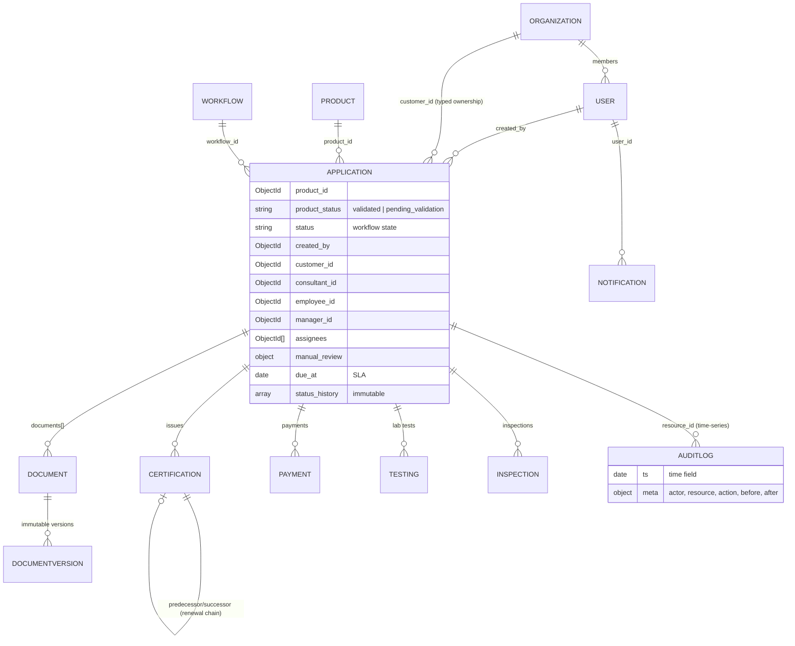
```mermaid
erDiagram
    ORGANIZATION ||--o{ USER : "members"
    USER ||--o{ APPLICATION : "created_by"
    ORGANIZATION ||--o{ APPLICATION : "customer_id (typed ownership)"
    APPLICATION ||--o{ CERTIFICATION : "issues"
    PRODUCT ||--o{ APPLICATION : "product_id"
    APPLICATION ||--o{ DOCUMENT : "documents[]"
    DOCUMENT ||--o{ DOCUMENTVERSION : "immutable versions"
    APPLICATION ||--o{ PAYMENT : "payments"
    APPLICATION ||--o{ TESTING : "lab tests"
    APPLICATION ||--o{ INSPECTION : "inspections"
    CERTIFICATION ||--o| CERTIFICATION : "predecessor/successor (renewal chain)"
    WORKFLOW ||--o{ APPLICATION : "workflow_id"
    USER ||--o{ NOTIFICATION : "user_id"
    APPLICATION ||--o{ AUDITLOG : "resource_id (time-series)"

    APPLICATION {
      ObjectId product_id
      string product_status "validated | pending_validation"
      string status "workflow state"
      ObjectId created_by
      ObjectId customer_id
      ObjectId consultant_id
      ObjectId employee_id
      ObjectId manager_id
      ObjectId[] assignees
      object manual_review
      date due_at "SLA"
      array status_history "immutable"
    }
    AUDITLOG {
      date ts "time field"
      object meta "actor, resource, action, before, after"
    }
```

- **Immutable history:** `Application.status_history` (append‑only) + `AuditLog` — a **time‑series collection** with a **5‑year TTL** and `meta.legal_hold` support (`models/AuditLog.ts`).
- **Typed ownership model:** `customer_id` (Organization) + `consultant_id`/`employee_id`/`manager_id` + immutable `created_by`; introduced **additively** with dual‑write + backfill/reconcile tooling. **Read‑cutover deferred** (reads still key off `created_by`).
- **Product resolution:** `product_status ∈ {validated, pending_validation}`; `manual_review` sub‑document carries the original product string, requested markets, and AI summary for manager triage.

---

## 11. Authentication Flow

Two first‑party methods: **Email OTP** and **Google OAuth**. JWT is **HS256** (algorithm pinned on verify — algorithm‑confusion safe), **access 30m**, **refresh 30d rotating** with a shared `jti` and a Redis **denylist** for revocation.

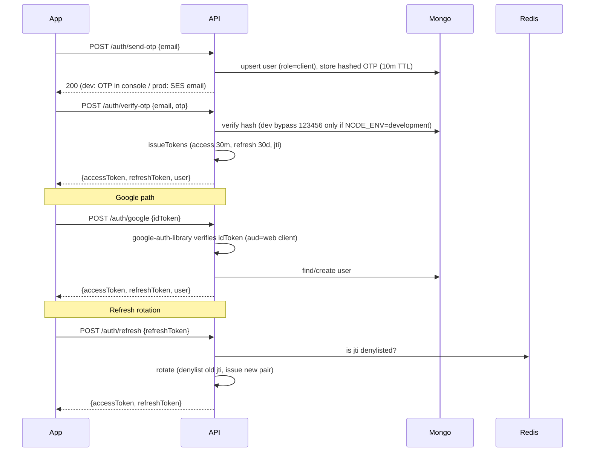
```mermaid
sequenceDiagram
    participant App
    participant API
    participant Mongo
    participant Redis

    App->>API: POST /auth/send-otp {email}
    API->>Mongo: upsert user (role=client), store hashed OTP (10m TTL)
    API-->>App: 200 (dev: OTP in console / prod: SES email)
    App->>API: POST /auth/verify-otp {email, otp}
    API->>Mongo: verify hash (dev bypass 123456 only if NODE_ENV=development)
    API->>API: issueTokens (access 30m, refresh 30d, jti)
    API-->>App: {accessToken, refreshToken, user}

    Note over App,API: Google path
    App->>API: POST /auth/google {idToken}
    API->>API: google-auth-library verifies idToken (aud=web client)
    API->>Mongo: find/create user
    API-->>App: {accessToken, refreshToken, user}

    Note over App,API: Refresh rotation
    App->>API: POST /auth/refresh {refreshToken}
    API->>Redis: is jti denylisted?
    API->>API: rotate (denylist old jti, issue new pair)
    API-->>App: {accessToken, refreshToken}
```

- **Per‑request auth** (`middleware/authMongo.ts:51,59`): verify JWT (`algorithms:['HS256']`) → check `jti` denylist → `User.findById(sub)` (401 if user missing) → attach `req.user`.
- **Mobile hardening:** on a *definitive* auth failure during refresh (401/403 or missing refresh token), the client clears all auth state and returns to Login; transient/offline errors preserve the session.
- **Secure storage:** mobile uses `expo-secure-store` (Keychain/Keystore); admin uses `localStorage` (SPA).

---

## 12. Authorization Flow (RBAC)

**Roles:** `super_admin, admin, consultant, employee, client, viewer, cb, lab, ib`.

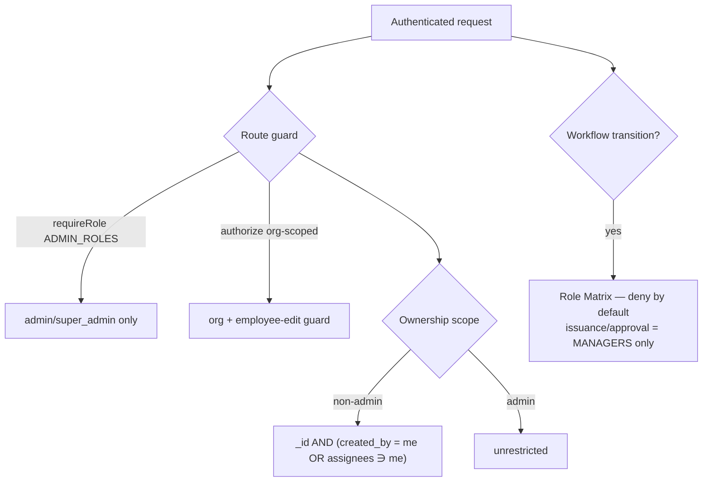
```mermaid
flowchart TB
    REQ[Authenticated request] --> R{Route guard}
    R -->|requireRole ADMIN_ROLES| ADM[admin/super_admin only]
    R -->|authorize org-scoped| ORG[org + employee-edit guard]
    R --> OWN{Ownership scope}
    OWN -->|non-admin| SCOPE["_id AND (created_by = me OR assignees ∋ me)"]
    OWN -->|admin| ALL[unrestricted]
    REQ --> WF{Workflow transition?}
    WF -->|yes| RM[Role Matrix — deny by default<br/>issuance/approval = MANAGERS only]
```

- **Deny‑by‑default workflow Role Matrix** (`services/workflow/roleMatrix.ts`): edge‑based `EDGE[from][to] = allowed roles`. Clients may only `submit`, re‑submit after `docs_required`, or `cancel` their own draft; **approvals and issuance are restricted to `admin/super_admin`**. Any edge not listed is denied to everyone.
- **IDOR prevention:** `scopeById()` (`routes/v2/applications.ts:26‑29`) constrains non‑admin reads/writes to `created_by`/`assignees`.
- **Resolve‑product / suggestions:** restricted to `admin/super_admin/employee` (`applications.ts:357,373`).

---

## 13. User Journey (Customer)

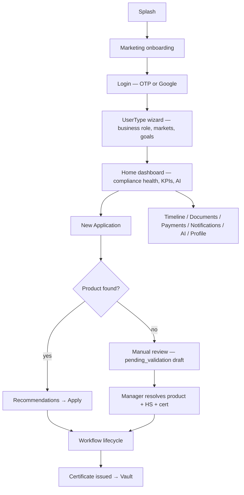
```mermaid
flowchart TB
    S[Splash] --> O[Marketing onboarding]
    O --> L[Login — OTP or Google]
    L --> UT[UserType wizard — business role, markets, goals]
    UT --> H[Home dashboard — compliance health, KPIs, AI]
    H --> NA[New Application]
    NA --> PF{Product found?}
    PF -->|yes| REC[Recommendations → Apply]
    PF -->|no| MR[Manual review — pending_validation draft]
    MR --> MGR[Manager resolves product + HS + cert]
    REC --> WF[Workflow lifecycle]
    MGR --> WF
    WF --> CERT[Certificate issued → Vault]
    H --> C360[Timeline / Documents / Payments / Notifications / AI / Profile]
```

**No dead ends:** both product‑found and product‑not‑found paths converge on the same workflow (verified E2E). A customer always receives a **Draft Application** even when the product is unknown.

---

## 14. Compliance Workflow (Application Lifecycle)

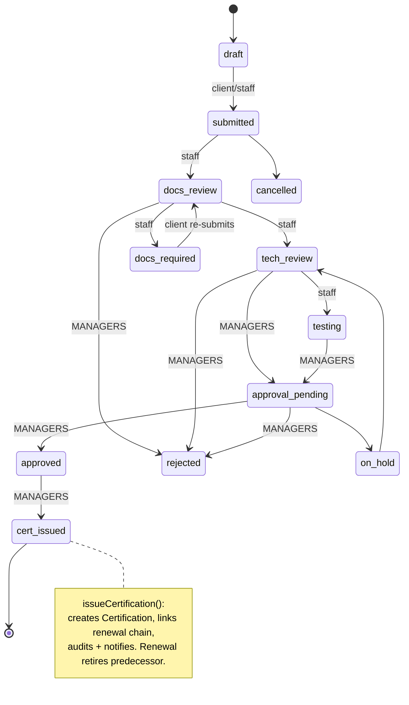
```mermaid
stateDiagram-v2
    [*] --> draft
    draft --> submitted: client/staff
    submitted --> docs_review: staff
    docs_review --> tech_review: staff
    docs_review --> docs_required: staff
    docs_required --> docs_review: client re-submits
    tech_review --> testing: staff
    tech_review --> approval_pending: MANAGERS
    testing --> approval_pending: MANAGERS
    approval_pending --> approved: MANAGERS
    approved --> cert_issued: MANAGERS
    cert_issued --> [*]
    docs_review --> rejected: MANAGERS
    tech_review --> rejected: MANAGERS
    approval_pending --> rejected: MANAGERS
    submitted --> cancelled
    approval_pending --> on_hold
    on_hold --> tech_review
    note right of cert_issued
      issueCertification():
      creates Certification, links renewal chain,
      audits + notifies. Renewal retires predecessor.
    end note
```

- **Single transition path:** `TransitionService.transition()` → pure `WorkflowEngine.evaluate()` (validity + Role Matrix + gate actions + SLA) → apply state + append immutable history → side effects (audit, notify assignees+creator, auto‑assignment) → terminal issuance.
- **Gates & SLA** (flag‑gated): `workflow_gates_enforced` blocks transitions on missing mandatory docs/payment; each stage sets `due_at`. **Assignment engine:** assign/reassign/unassign/escalate + flag‑gated auto‑routing (least‑loaded by role). **Override:** admin escape hatch (reason required, fully audited).

---

## 15. Document Processing Workflow

```mermaid
sequenceDiagram
    participant Client
    participant API
    participant S3
    Client->>API: POST /documents (presign request)
    API->>S3: create presigned PUT (TTL = AWS_S3_PRESIGNED_URL_EXPIRES)
    API-->>Client: {uploadUrl, key}
    Client->>S3: PUT file directly (bytes never touch API)
    Client->>API: POST /documents/finalize {key, metadata}
    API->>API: create Document + DocumentVersion (immutable)
    API-->>Client: 200
    Note over API,S3: Downloads via presigned GET; versioning preserves history
```

- **Presigned‑S3 pattern** (`documentService.ts`) — the server issues time‑boxed URLs; file bytes flow client↔S3 directly. **Immutable versioning** via `DocumentVersion`. Scoping: org members see org docs; org‑less users see only their own uploads.
- **AI image uploads** (product analysis) go through `multer` with **4 MB + MIME allow‑list** (`routes/ai.ts:25‑28`).

---

## 16. AI Processing Workflow

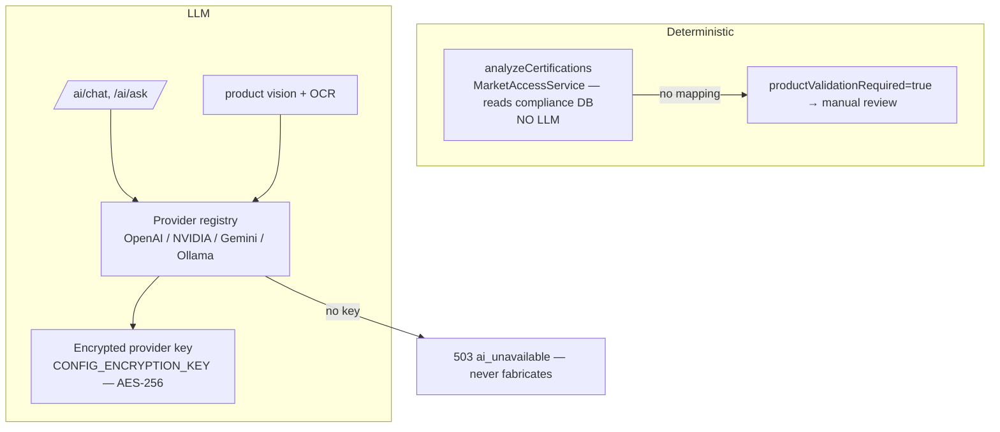
```mermaid
flowchart TB
    subgraph Deterministic
      RESOLVE[analyzeCertifications<br/>MarketAccessService — reads compliance DB<br/>NO LLM]
      RESOLVE -->|no mapping| MRV[productValidationRequired=true → manual review]
    end
    subgraph LLM
      CHAT[/ai/chat, /ai/ask/]
      VISION[product vision + OCR]
      REG[Provider registry<br/>OpenAI / NVIDIA / Gemini / Ollama]
      KEY[Encrypted provider key<br/>CONFIG_ENCRYPTION_KEY — AES-256]
      CHAT --> REG --> KEY
      VISION --> REG
    end
    REG -->|no key| U503[503 ai_unavailable — never fabricates]
```

- **Certification analysis is DATA‑driven, not LLM‑driven** (`aiService.ts:368‑406`) — it delegates to a single canonical resolver reading the compliance database; unknown products return `productValidationRequired: true` (routing to manual review), never invented codes.
- **BYO provider key**, stored **encrypted at rest** (`CONFIG_ENCRYPTION_KEY`, 32‑byte, validated at boot). In production, environment provider keys are ignored — only the encrypted credential store is used.
- **Honest failure:** every LLM endpoint returns `503 ai_unavailable` when no provider is configured (no fabricated compliance answers).

---

## 17. Notification Workflow

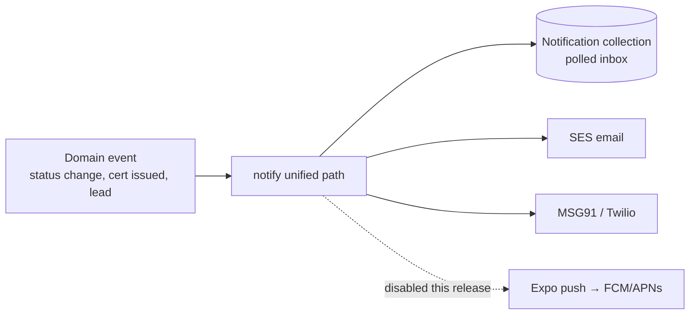
```mermaid
flowchart LR
    EV[Domain event<br/>status change, cert issued, lead] --> NOTIFY[notify unified path]
    NOTIFY --> INAPP[(Notification collection<br/>polled inbox)]
    NOTIFY --> EMAIL[SES email]
    NOTIFY --> SMSc[MSG91 / Twilio]
    NOTIFY -. disabled this release .-> PUSH[Expo push → FCM/APNs]
```

- **Channels:** in‑app (persisted, polled via `/notifications`), email (SES), SMS (MSG91/Twilio), and **mobile push (Expo) — disabled this release** behind `enable_push_notifications` (post‑launch; requires FCM/APNs credentials). Backend push infra (`expo_push_tokens`, `services/notifications/push.ts` using `expo-server-sdk`) is complete and dormant.
- **Two coexisting paths** (documented tech debt): unified `notify()` (workflow) and legacy `notificationService.sendPush/notify` (leads/meetings/etc.) — both functional; consolidation deferred.

---

## 18. Payment Workflow

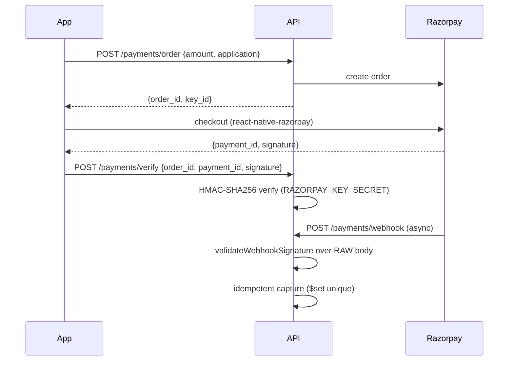
```mermaid
sequenceDiagram
    participant App
    participant API
    participant Razorpay
    App->>API: POST /payments/order {amount, application}
    API->>Razorpay: create order
    API-->>App: {order_id, key_id}
    App->>Razorpay: checkout (react-native-razorpay)
    Razorpay-->>App: {payment_id, signature}
    App->>API: POST /payments/verify {order_id, payment_id, signature}
    API->>API: HMAC-SHA256 verify (RAZORPAY_KEY_SECRET)
    Razorpay->>API: POST /payments/webhook (async)
    API->>API: validateWebhookSignature over RAW body
    API->>API: idempotent capture ($set unique)
```

- **Double verification:** synchronous signature verify on `/verify` **and** async `/webhook` with `Razorpay.validateWebhookSignature` over the **raw body** (`razorpayService.ts:168`). **Idempotency** guards double‑capture (`payments.idempotency.test.ts`).
- **Env fail‑fast:** production refuses to boot on missing `RAZORPAY_*` and **rejects `rzp_test_*`** live (`validateEnv.ts`). `razorpayKeyId` in `app.json` is the **publishable** key_id (public by design).

---

## 19. API Flow

- **Versioning:** `/api/v1` and `/api/v2` are the **same** router (additive, non‑breaking). New fields/endpoints are additive.
- **Consistency:** JSON envelopes (`{success, data, message}` or `{data}`/`{error}`); Zod validation; centralized error normalization; pagination on list endpoints (e.g., `?page=&limit=`).
- **Rate limits (Redis‑backed, shared across workers):** general **300 / 15 min / IP**; tighter OTP send/verify, AI (**30 / 15 min**), upload (**60 / 15 min**).
- **Health:** `GET /health` → 200 + `mongo:true` (503 degraded) — wired to platform probes.

---

## 20. Sequence Diagram — End‑to‑End Certification (verified E2E)

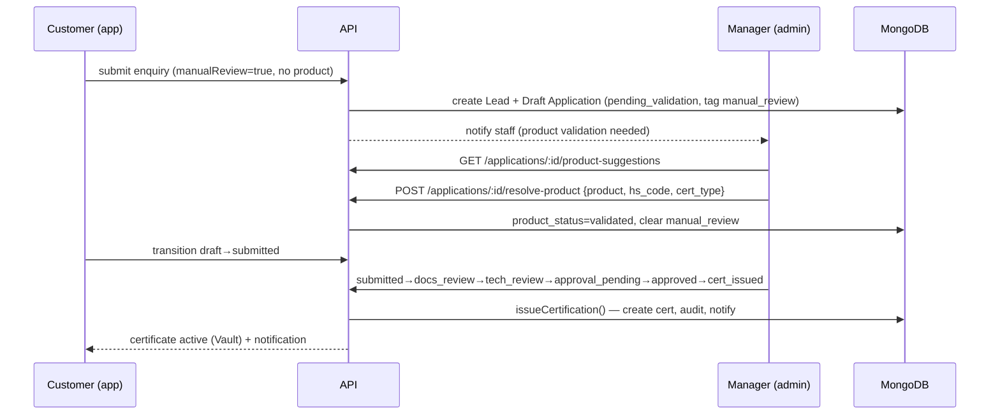
```mermaid
sequenceDiagram
    participant Cust as Customer (app)
    participant API
    participant Mgr as Manager (admin)
    participant DB as MongoDB

    Cust->>API: submit enquiry (manualReview=true, no product)
    API->>DB: create Lead + Draft Application (pending_validation, tag manual_review)
    API-->>Mgr: notify staff (product validation needed)
    Mgr->>API: GET /applications/:id/product-suggestions
    Mgr->>API: POST /applications/:id/resolve-product {product, hs_code, cert_type}
    API->>DB: product_status=validated, clear manual_review
    Cust->>API: transition draft→submitted
    Mgr->>API: submitted→docs_review→tech_review→approval_pending→approved→cert_issued
    API->>DB: issueCertification() — create cert, audit, notify
    API-->>Cust: certificate active (Vault) + notification
```

---

## 21. Class Diagram (Workflow core)

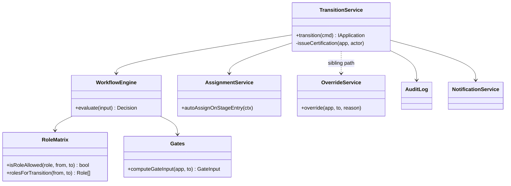
```mermaid
classDiagram
    class TransitionService {
      +transition(cmd) IApplication
      -issueCertification(app, actor)
    }
    class WorkflowEngine {
      +evaluate(input) Decision
    }
    class RoleMatrix {
      +isRoleAllowed(role, from, to) bool
      +rolesForTransition(from, to) Role[]
    }
    class Gates {
      +computeGateInput(app, to) GateInput
    }
    class AssignmentService {
      +autoAssignOnStageEntry(ctx)
    }
    class OverrideService {
      +override(app, to, reason)
    }
    TransitionService --> WorkflowEngine
    WorkflowEngine --> RoleMatrix
    WorkflowEngine --> Gates
    TransitionService --> AssignmentService
    TransitionService ..> OverrideService : sibling path
    TransitionService --> AuditLog
    TransitionService --> NotificationService
```

---

## 22. Deployment Diagram

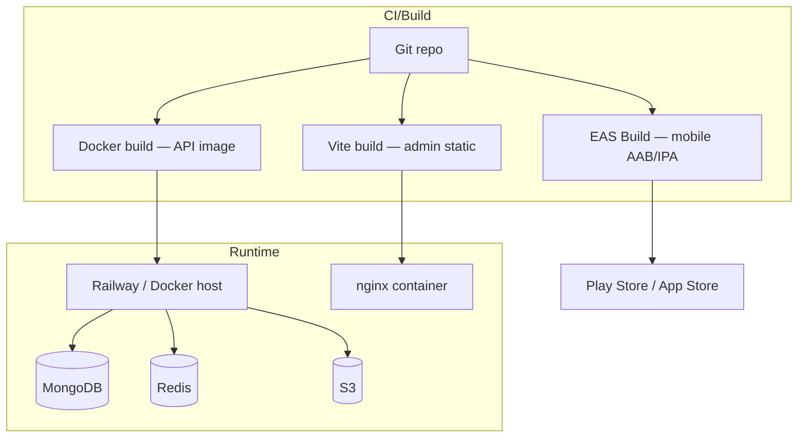
```mermaid
flowchart TB
    subgraph CI/Build
      GH[Git repo] --> EAS[EAS Build — mobile AAB/IPA]
      GH --> DBUILD[Docker build — API image]
      GH --> ABUILD[Vite build — admin static]
    end
    subgraph Runtime
      RAIL[Railway / Docker host]
      DBUILD --> RAIL
      ABUILD --> NGINX[nginx container]
      RAIL --> MONGO[(MongoDB)]
      RAIL --> REDIS[(Redis)]
      RAIL --> S3[(S3)]
    end
    EAS --> STORE[Play Store / App Store]
```

- **Mobile:** EAS‑managed builds/credentials (`eas.json` `production` = Android **app‑bundle**; production Android AABs already **FINISHED** on EAS, signed with the EAS keystore — not debug). iOS signing via EAS.
- **Backend:** Docker image → Railway (`db:migrate && node dist/index.js`) with `/health` probes and restart policy.
- **Admin:** static build served by nginx.

---

## 23. DevOps Pipeline (current + gap)

```mermaid
flowchart LR
    Dev[Commit] --> LocalV[Local: tsc + tests + expo run]
    LocalV --> Manual[Manual EAS build + Docker deploy]
    Manual --> Prod[Railway + Store submission]
    classDef gap fill:#fde,stroke:#c33;
    CI[CI pipeline<br/>build+test on PR]:::gap
    Dev -.missing.-> CI
```

- **Current:** local `tsc --noEmit`, backend Jest suite, `expo run:*`; deploy via EAS + Docker/Railway.
- **Gap [P3]:** **no CI pipeline** in `.github/workflows` (documented in KNOWN_LIMITATIONS). **Plan:** add GitHub Actions running backend `build+test`, admin `build`, mobile `tsc`, and EAS build on tagged releases.

---

## 24. Security Architecture

```mermaid
flowchart TB
    subgraph Perimeter
      TLS[TLS at proxy] --> CORS[CORS allowlist]
      CORS --> RL[Redis rate limits]
    end
    subgraph AppSec
      RL --> JWT[JWT HS256 pinned + jti denylist]
      JWT --> RBACx[Deny-by-default Role Matrix + org scoping]
      RBACx --> VALz[Zod validation + stripProtected mass-assign guard]
    end
    subgraph DataSec
      ENC[Provider keys AES-256 at rest]
      AUD[Immutable time-series audit — 5yr TTL]
      SECRETS[.env gitignored; validateEnv fail-fast]
    end
    subgraph Headers
      CSP[CSP + Referrer-Policy + CORP + helmet-class]
    end
```

**Verified controls:** HS256 pinned; access/refresh with rotating `jti` denylist; deny‑by‑default RBAC; `scopeById` IDOR guard; mass‑assignment guard (`stripProtected`); Zod validation; Mongoose parameterization (no string‑concatenated queries); Razorpay HMAC + webhook over raw body; presigned‑S3 + MIME/size‑limited AI uploads; CSP + security headers; explicit CORS; Redis rate limits; `trust proxy`; secrets gitignored + `validateEnv` fail‑fast; OTP dev‑bypass gated to `NODE_ENV=development`.

---

## 25. Threat Model (STRIDE, condensed)

| Threat | Vector | Mitigation (evidence) | Residual |
|---|---|---|---|
| **Spoofing** | Forged JWT / algorithm confusion | HS256 pinned on verify; per‑request `User.findById` | Rotate `JWT_SECRET` on compromise |
| **Tampering** | Payment/webhook forgery | HMAC verify + `validateWebhookSignature` (raw body) | — |
| **Repudiation** | Deny an action | Immutable `status_history` + time‑series AuditLog (5y) | — |
| **Info disclosure** | IDOR / cross‑tenant read | `scopeById` (created_by/assignees); org scoping | Complete ownership read‑cutover |
| **DoS** | Request floods / OTP abuse | Redis rate limits (general/OTP/AI/upload) | Single‑instance jobs (scale note) |
| **Elevation** | Client self‑approves cert | Deny‑by‑default Role Matrix (issuance = managers) | — |
| **Secrets** | Key leakage | `.env` gitignored; AES‑256 provider keys; no keys in repo | Rotate on staff change |

**[ASSUMPTION]** No WAF/bot‑management layer in code — recommend platform WAF for GA.

---

## 26. Disaster Recovery

- **Stateless API** → redeploy previous image tag for instant rollback.
- **Feature flags** default OFF → instant behavioral rollback.
- **Ownership migration** is additive + dual‑written; `migrate:ownership --revert` nulls typed fields; `created_by`/legacy never mutated.
- **[GAP/Plan]** Define **RTO/RPO** targets and a documented restore runbook. **[ASSUMPTION]** RTO ≤ 1h, RPO ≤ 15m are achievable with Atlas continuous backup + stateless redeploy — to be formalized.

---

## 27. Backup Strategy

- **MongoDB:** enable automated snapshots (Atlas continuous backup or `mongodump` cron) — `DEPLOYMENT_GUIDE §9`.
- **AuditLog:** 5‑year TTL time‑series — **exclude from destructive cleanups**; `meta.legal_hold` for longer holds.
- **S3:** enable **versioning + lifecycle**.
- **[GAP]** Backups are **recommended, not codified** — add IaC/automation + periodic restore drills for SOC 2.

---

## 28. Scalability Strategy

```mermaid
flowchart LR
    LB[Proxy] --> A1[API #1]
    LB --> A2[API #2]
    A1 & A2 --> RS[(Redis — shared rate-limit + cache)]
    A1 & A2 --> M[(MongoDB — pool 50/5)]
    JQ[Job runner — single leader]:::note
    classDef note fill:#eef,stroke:#66c;
```

- **Horizontal‑ready:** stateless API; Redis‑shared rate limiting/cache; Mongo pool 50/5. PM2 cluster supported via `process.send('ready')`.
- **Scaling constraint [P3]:** background jobs use in‑process **`setInterval`** (fine single‑instance; would **double‑fire** across replicas). **Plan:** migrate to **BullMQ/Redis** or a leader‑elected scheduler before multi‑replica scale (already noted in `jobs/index.ts`).
- **Data scale:** time‑series audit + TTL controls growth; add missing indexes (`AIConversation`, `UserProduct`).

---

## 29. Monitoring

- **Present:** `/health` (liveness/readiness), structured `logger`, `morgan` HTTP logs, container `HEALTHCHECK`.
- **[GAP/Plan]** No APM/error‑tracking/uptime alerting in code. **Plan:** add **Sentry** (backend + mobile), uptime + DB‑lag alerts, and dashboards (latency, error rate, queue depth). Required for SOC 2 availability/monitoring criteria.

---

## 30. Logging

- **Backend:** Winston (`logger`) with levels (info/warn/error/http); `morgan('combined')` piped to `logger.http`. **Audit** is separate and immutable (time‑series).
- **Mobile:** `console.warn/error` for diagnostics (e.g., ErrorBoundary, push failures) — pluggable into Sentry later.
- **[Control]** No secrets logged (verified: tokens/keys not emitted). **[Plan]** Centralize to a log sink (e.g., CloudWatch/Datadog) with retention for audit trails.

---

## 31. Performance Optimization

- **Mobile:** Hermes + New Architecture; React Query caching (staleTime 5m/gcTime 30m); memoized styles; Reanimated 4 on the UI thread; FlatList usage.
- **Backend:** `compression`; Redis cache facade; connection pooling; presigned‑S3 offloads file I/O from the API.
- **Debt [P3]:** missing indexes on `AIConversation`/`UserProduct`; potential N+1 in list endpoints that `populate` — **Plan:** add indexes + review populate fan‑out with `.lean()` and projections (some already use `.lean()`).

---

## 32. Cost Optimization

- Minimal managed footprint (API container + MongoDB + Redis + S3 + SES) keeps baseline low.
- **Levers:** S3 lifecycle → Infrequent Access/Glacier for old documents; Redis right‑sizing; single AI provider with BYO key (cost passes to configured provider); scale replicas only when job scheduler is externalized.
- **[ASSUMPTION]** Free/hobby tiers referenced in `render.yaml` are dev‑only; production sizing (Atlas M10+, adequate Redis) per `DEPLOYMENT_GUIDE`.

---

## 33. Future Roadmap

1. **Push notifications** (FCM/APNs + `google-services.json` + EAS credentials) — flip `enable_push_notifications`.
2. **Ownership read‑cutover** + RBAC assignment‑scoping (after prod backfill + reconcile).
3. **MCA/GSTIN lookup** (integrate MCA21/GST APIs) — flip `enable_mca_gstin_lookup`.
4. **iOS Universal Links** (associated‑domains + AASA).
5. **CI/CD**, **Sentry + alerting**, **BullMQ** job runner.
6. Notification‑path consolidation onto unified `notify()`.

---

## 34. Technical Debt (from KNOWN_LIMITATIONS + audit)

| Item | Severity | Note |
|---|---|---|
| Two notification paths coexist | P3 | both functional; consolidate onto `notify()` |
| In‑process `setInterval` jobs | P3 | externalize before multi‑replica |
| Missing indexes (`AIConversation`, `UserProduct`) | P3 | add for query perf |
| Ownership read‑cutover deferred | P2 | reads via `created_by` |
| `render.yaml` references Postgres | P3 | stale; app is Mongo |
| Dead push helper files | P3 | `pushNotificationService`, `usePushNotifications` unused |
| 1 pre‑existing failing test (`leads.draftApplication`) | P3 | documented, unrelated |
| No CI | P3 | add pipeline |

---

## 35. Risks

- **External‑dependency readiness:** live Razorpay/SES/S3/AI/SMS require credentials + real‑world testing (not exercisable in dev).
- **Single‑instance job coupling** blocks naive horizontal scale.
- **Monitoring gap** reduces incident MTTR until Sentry/alerting land.
- **Store review:** Android signing (EAS, resolved), permissions (minimized), Apple 4.8 (satisfied by email OTP) — low residual risk.

---

## 36. Recommendations (prioritized)

1. **Before GA (operational):** produce EAS store builds; fill prod `.env`; enable Mongo backups + S3 versioning; add Sentry + uptime alerts.
2. **Short‑term:** add CI; add missing indexes; correct/remove `render.yaml`; document RTO/RPO + restore runbook.
3. **Scale prep:** externalize job scheduler (BullMQ); complete ownership read‑cutover.
4. **Post‑launch features:** push, MCA/GSTIN, Universal Links.

---

## 37–46. Scorecard

> Scores reflect the audited state of the codebase (RC v2.0.0). 100 = enterprise best‑in‑class.

| # | Dimension | Score | Rationale |
|---|---|---:|---|
| 37 | **Production Readiness** | **88** | No P0/P1 code blockers; builds/tests/E2E green; operational items (store build, creds, monitoring) remain |
| 38 | **Architecture** | **90** | Single authoritative workflow path; clean service layering; additive versioning; immutable audit |
| 39 | **Security** | **88** | Pinned JWT, deny‑by‑default RBAC, IDOR scoping, HMAC payments, encrypted keys, rate limits; missing WAF/monitoring |
| 40 | **Scalability** | **78** | Stateless + Redis‑shared; blocked by in‑process job scheduler for multi‑replica |
| 41 | **Maintainability** | **85** | TypeScript throughout, tests, docs; some tech debt + no CI |
| 42 | **UI/UX** | **85** | Polished flows, no dead ends, ErrorBoundary, offline banner; a few empty‑state gaps |
| 43 | **Mobile** | **86** | New Arch + Hermes, hardened auth/session, resilient boundary; push deferred |
| 44 | **Backend** | **90** | Robust workflow/RBAC/payments/audit; graceful shutdown; strong validation |
| 45 | **Infrastructure** | **80** | Docker/Railway/EAS solid; backups + monitoring + CI not codified |
| **46** | **Overall** | **86 / 100** | **Enterprise‑ready core; GA‑gated on operational hardening** |

---

### Appendix A — Environment / Credentials matrix (production)

| Category | Required vars |
|---|---|
| Core | `MONGODB_URI`, `REDIS_URL`, `CONFIG_ENCRYPTION_KEY` (32‑byte) |
| Auth | `JWT_SECRET`, `JWT_REFRESH_SECRET` |
| Payments | `RAZORPAY_KEY_ID` (live), `RAZORPAY_KEY_SECRET`, `RAZORPAY_WEBHOOK_SECRET` |
| AWS | `AWS_ACCESS_KEY_ID`, `AWS_SECRET_ACCESS_KEY`, `AWS_REGION`, `AWS_S3_BUCKET` |
| Email/SMS | `EMAIL_FROM`, `MSG91_*` / `TWILIO_*` |
| CORS | `FRONTEND_URL`, `ADMIN_URL` |
| Mobile (EAS) | `EXPO_PUBLIC_API_URL`, Google client IDs |
| AI | provider key via **Admin panel** (encrypted at rest — not env in prod) |

### Appendix B — Document provenance
Derived from: `CLAUDE.md`, `README.md`, `RELEASE_NOTES.md`, `RELEASE_CHECKLIST.md`, `RELEASE_CERTIFICATION.md`, `KNOWN_LIMITATIONS.md`, `DEPLOYMENT_GUIDE.md`, `docs/*`, and direct code inspection of `backend/src/**`, `admin-dashboard/src/**`, `mobile-app/**`, `app.json`, `eas.json`, `Dockerfile`, `docker-compose.yml`, `railway.json`.

*End of document.*
