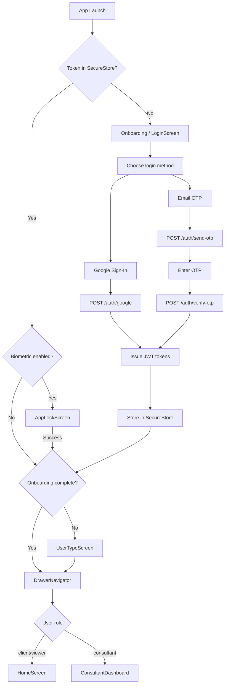

# DICE — User Login Workflow & Role-Based Access

> Complete authentication flow for all user types: clients, consultants, certification bodies (CB), inspection bodies (IB), labs, admins, and employees.

---

## 1. Supported User Roles

Defined in `backend/src/models/User.ts`:

| Role | Code | Description | Primary App |
|------|------|-------------|-------------|
| `super_admin` | Platform owner | Full system access | Admin Dashboard |
| `admin` | Operations manager | Manage clients, apps, employees | Admin Dashboard |
| `consultant` | External consultant | Manage assigned clients | Mobile App (Consultant Mode) |
| `employee` | Internal staff | Process applications | Admin Dashboard + Mobile |
| `client` | Business customer | Apply for certifications, track progress | Mobile App |
| `viewer` | Read-only client | View only | Mobile App |
| `cb` | Certification Body | Review & issue certificates | Admin Dashboard |
| `lab` | Testing Laboratory | Manage testing jobs | Admin Dashboard |
| `ib` | Inspection Body | Manage inspections | Admin Dashboard |

---

## 2. Login Channels

### 2.1 Mobile App Login

```
┌─────────────────────────────────────────────────────────────┐
│  Mobile App (com.sanyogconformity.app)                      │
│                                                             │
│  LoginScreen                                                │
│    ├── Google Sign-In (native @react-native-google-signin) │
│    └── Email/Phone OTP                                      │
│            ↓                                                │
│    POST /api/v1/auth/google  OR  /api/v1/auth/verify-otp    │
│            ↓                                                │
│    Returns: accessToken + refreshToken + user object        │
│            ↓                                                │
│    Store tokens in SecureStore                              │
│    Set authStore.isAuthenticated = true                     │
│            ↓                                                │
│    Route based on role & onboarding state                   │
└─────────────────────────────────────────────────────────────┘
```

### 2.2 Admin Dashboard Login

```
┌─────────────────────────────────────────────────────────────┐
│  Admin Dashboard (React + Vite)                             │
│                                                             │
│  LoginPage                                                  │
│    └── Email + OTP only                                     │
│            ↓                                                │
│    POST /api/v1/auth/send-otp  { email, is_admin_portal }   │
│            ↓                                                │
│    POST /api/v1/auth/verify-otp                             │
│            ↓                                                │
│    Backend rejects if role NOT in allowed admin roles       │
│    Allowed: super_admin, admin, cb, lab, ib, employee,      │
│             consultant                                      │
│            ↓                                                │
│    Store tokens → redirect to dashboard                     │
└─────────────────────────────────────────────────────────────┘
```

---

## 3. Authentication Methods

### 3.1 Google Sign-In (Mobile)

```
User taps "Sign in with Google"
        ↓
@react-native-google-signin/google-signin
    requests ID token from Google
        ↓
POST /api/v1/auth/google
    { idToken }
        ↓
Backend verifies ID token with google-auth-library
    audience = GOOGLE_CLIENT_IDS
        ↓
Find user by email
    ├── Exists → update avatar, email_verified_at
    └── New → create User with role='client'
        ↓
issueTokens(user) → accessToken + refreshToken
        ↓
Return user profile with counts
```

### 3.2 OTP via Email

```
User enters email
        ↓
POST /api/v1/auth/send-otp
    { email, phone?, name?, is_admin_portal? }
        ↓
Backend:
    1. Rate limit check (5 requests / 15 min / IP)
    2. Find or create user
       • Admin portal: reject if role not allowed
    3. Generate 6-digit crypto-random OTP
    4. Hash OTP with SHA256(JWT_SECRET + otp)
    5. Save hash + expiry (10 min) + reset attempts
    6. Send email via AWS SES / SMTP fallback
        ↓
User enters OTP
        ↓
POST /api/v1/auth/verify-otp
    { email, otp }
        ↓
Backend:
    1. Rate limit check (10 verify / 15 min / IP)
    2. Find user with otp fields
    3. Check attempts < 5
    4. Check OTP not expired
    5. Hash input OTP, compare with stored hash
       • Dev bypass: otp === '123456' in development
    6. Clear OTP state, set email_verified_at
    7. Issue tokens
        ↓
Return accessToken + refreshToken + user
```

### 3.3 Token Refresh

```
Access token expires (15 minutes)
        ↓
API call returns 401
        ↓
Axios interceptor calls
    POST /api/v1/auth/refresh
        { refreshToken }
        ↓
Backend verifies refresh token (JWT_REFRESH_SECRET)
        ↓
Issue new accessToken + new refreshToken
        ↓
Retry original request
```

### 3.4 Logout

```
User taps logout
        ↓
POST /api/v1/auth/logout
    { refreshToken, push_token? }
        ↓
Backend:
    • Verifies refresh token
    • Removes push token from user record
    • Audit log: logged_out
        ↓
Frontend clears SecureStore
        ↓
Reset authStore → return to LoginScreen
```

---

## 4. Post-Login Routing Logic

### 4.1 Mobile App Routing (`RootNavigator`)

```
After successful login / app launch:
        ↓
Load from SecureStore:
    token, refreshToken, userData,
    onboardingDone, userType, userTypeDone,
    biometricEnabled
        ↓
Decision tree:

if no token:
    → Onboarding → LoginScreen

else if biometricEnabled and not authenticated locally:
    → AppLockScreen (Face ID / Fingerprint / PIN)

else if !userTypeDone:
    → UserTypeSelectionScreen → UserTypeScreen (6-step wizard)

else if !onboardingDone:
    → UserTypeScreen wizard

else:
    → DrawerNavigator (Main app)
        if role === 'consultant' and enable_consultant_mode:
            → ConsultantDashboardScreen
        else:
            → HomeScreen
```

### 4.2 Admin Dashboard Routing

```
After login:
        ↓
Check user.role
        ↓
if role in [super_admin, admin]:
    → Full dashboard access

elif role in [cb, lab, ib]:
    → Partner portal (applications/certifications assigned to them)

elif role === 'employee':
    → Employee portal (assigned tasks & applications)

elif role === 'consultant':
    → Consultant portal (assigned clients)

else:
    → Access denied
```

---

## 5. Role-Based Access Control (RBAC)

### 5.1 Backend Middleware (`middleware/authorize.ts`)

```typescript
// Example role guards
requireRole(['super_admin', 'admin'])
requireRole(['super_admin', 'admin', 'consultant', 'employee'])
requireRole(['super_admin', 'admin', 'cb'])          // Certification bodies
requireRole(['super_admin', 'admin', 'lab'])         // Testing labs
requireRole(['super_admin', 'admin', 'ib'])          // Inspection bodies
requireRole(['client', 'viewer'])                    // Customer app
```

### 5.2 Permission Matrix

| Capability | super_admin | admin | consultant | employee | client | viewer | cb | lab | ib |
|------------|:-----------:|:-----:|:----------:|:--------:|:------:|:------:|:--:|:---:|:--:|
| Manage users/orgs | ✅ | ✅ | ❌ | ❌ | ❌ | ❌ | ❌ | ❌ | ❌ |
| View all applications | ✅ | ✅ | Assigned | Assigned | Own | Own | Assigned | Assigned | Assigned |
| Create application | ✅ | ✅ | ✅ | ✅ | ✅ | ❌ | ❌ | ❌ | ❌ |
| Update application status | ✅ | ✅ | ✅ | ✅ | ❌ | ❌ | ✅ | ✅ | ✅ |
| Upload certificates | ✅ | ✅ | ✅ | ✅ | ❌ | ❌ | ✅ | ❌ | ❌ |
| Upload test reports | ✅ | ✅ | ✅ | ✅ | ❌ | ❌ | ❌ | ✅ | ❌ |
| Upload inspection reports | ✅ | ✅ | ✅ | ✅ | ❌ | ❌ | ❌ | ❌ | ✅ |
| Manage payments | ✅ | ✅ | ❌ | ❌ | Own | View | ❌ | ❌ | ❌ |
| View analytics | ✅ | ✅ | Assigned | Assigned | Own | Own | Limited | Limited | Limited |
| Manage remote config | ✅ | ❌ | ❌ | ❌ | ❌ | ❌ | ❌ | ❌ | ❌ |
| Send notifications | ✅ | ✅ | ❌ | ❌ | ❌ | ❌ | ❌ | ❌ | ❌ |
| Access AI assistant | ✅ | ✅ | ✅ | ✅ | ✅ | ✅ | ✅ | ✅ | ✅ |

---

## 6. User Type / Business Role Onboarding

### 6.1 Business Roles (Mobile Onboarding Step 1)

From `mobile-app/src/utils/constants.ts`:

| ID | Label | Typical Use |
|----|-------|-------------|
| `manufacturer` | Manufacturer | Makes products needing BIS/CE/etc. |
| `importer` | Importer | Imports goods into India |
| `exporter` | Exporter | Exports to Saudi/GCC/EU/etc. |
| `supplier` | Supplier / Trader | Sells products domestically |
| `logistics` | Logistics / Shipping | Freight & customs coordination |
| `consultant` | Service Provider / Consultant | Helps clients with compliance |
| `individual` | Individual | Personal use / freelancer |
| `freelancer` | Freelancer | Independent compliance professional |

### 6.2 Mapping Business Role → Backend Role

```
Business role (onboarding)    Backend role
─────────────────────────────────────────
manufacturer/importer/        client
exporter/supplier/logistics/
individual

consultant/freelancer         consultant (after admin approval)
                              OR client (if self-service)

Admin dashboard users         admin / super_admin / cb / lab / ib / employee
```

### 6.3 Consultancy Mode

```
User selects "consultant" during onboarding
        ↓
Backend creates user with role='consultant'
        ↓
Admin must approve & assign clients (via admin-dashboard)
        ↓
Consultant logs into mobile app
        ↓
ConsultantDashboardScreen shows assigned clients
        ↓
Can view client applications, upload docs, chat on behalf
```

---

## 7. Certification Body (CB), Lab, IB Partner Login

### 7.1 Partner Onboarding

```
External partner applies via:
    • mobile-app PartnerOnboardingScreen
    • admin-dashboard direct invite
        ↓
POST /partners/apply
    { type: 'cb' | 'lab' | 'ib', company details, documents }
        ↓
Admin reviews in admin-dashboard → approve/reject
        ↓
On approval:
    • Create Organization record
    • Create User with role='cb' | 'lab' | 'ib'
    • Link user to org_id
        ↓
Partner receives login credentials / OTP
```

### 7.2 Partner Login Flow

```
Partner opens admin-dashboard
        ↓
Login with email + OTP
        ↓
Backend checks is_admin_portal=true
        ↓
Role must be in [super_admin, admin, cb, lab, ib, employee, consultant]
        ↓
Redirect to partner-specific dashboard:
    • CB: Review applications, issue certificates
    • Lab: Accept testing jobs, upload reports
    • IB: Accept inspections, upload reports
```

### 7.3 Partner Scopes

| Partner Type | Org Role | Can Access |
|--------------|----------|------------|
| Certification Body (CB) | `cb` | Assigned certification applications, issue certs |
| Testing Laboratory (Lab) | `lab` | Assigned testing jobs, upload test reports |
| Inspection Body (IB) | `ib` | Assigned inspections, upload inspection reports |

---

## 8. Security & Compliance

### 8.1 Passwordless-First Design

- Primary login is OTP + Google OAuth
- Optional password can be set for admin dashboard (future)
- Passwords stored with bcrypt if used

### 8.2 Two-Factor Authentication (TOTP)

```
High-privilege accounts (super_admin, admin)
        ↓
Can enable TOTP in settings
        ↓
Backend stores totp_secret (encrypted)
        ↓
Login requires OTP + TOTP code
```

### 8.3 Device Management

```
User logs in from new device
        ↓
Backend stores device info + push token
        ↓
DeviceSessionsScreen lists active sessions
        ↓
User can revoke sessions remotely
```

### 8.4 Audit Logging

Every auth event is logged to `AuditLog`:

| Action | When |
|--------|------|
| `logged_in` | Successful login |
| `logged_out` | Logout |
| `otp_sent` | OTP requested |
| `otp_failed` | Invalid OTP attempt |
| `token_refreshed` | Access token refreshed |
| `session_revoked` | Device session removed |

---

## 9. Login Flow Diagram



---

## 10. API Endpoints Summary

| Method | Endpoint | Purpose | Access |
|--------|----------|---------|--------|
| POST | `/api/v1/auth/send-otp` | Request OTP | Public |
| POST | `/api/v1/auth/verify-otp` | Verify OTP & login | Public |
| POST | `/api/v1/auth/google` | Google OAuth login | Public |
| POST | `/api/v1/auth/refresh` | Refresh access token | Public (with refresh token) |
| POST | `/api/v1/auth/logout` | Logout & cleanup | Authenticated |
| GET | `/api/v1/auth/profile` | Get current user | Authenticated |
| PUT | `/api/v1/users/me` | Update profile | Authenticated |
| POST | `/api/v1/users/me/onboarding` | Save onboarding | Authenticated |

---

## 11. Environment Variables (Auth)

```bash
# Backend
JWT_SECRET=...
JWT_REFRESH_SECRET=...
GOOGLE_CLIENT_ID=...
GOOGLE_CLIENT_IDS=...          # comma-separated for mobile + web + iOS
GOOGLE_CLIENT_SECRET=...       # for admin dashboard OAuth

# Email (OTP delivery)
AWS_ACCESS_KEY_ID=...
AWS_SECRET_ACCESS_KEY=...
AWS_SES_FROM=...
SMTP_HOST=...
SMTP_USER=...
SMTP_PASS=...

# SMS
MSG91_AUTH_KEY=...

# Mobile app
API_BASE_URL=...
GOOGLE_IOS_CLIENT_ID=...
GOOGLE_WEB_CLIENT_ID=...
```
